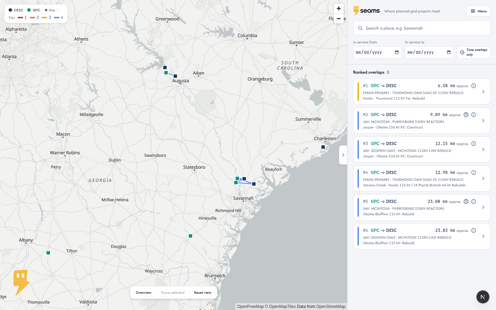
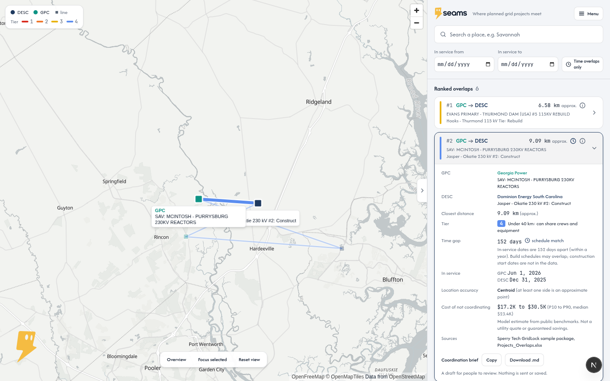
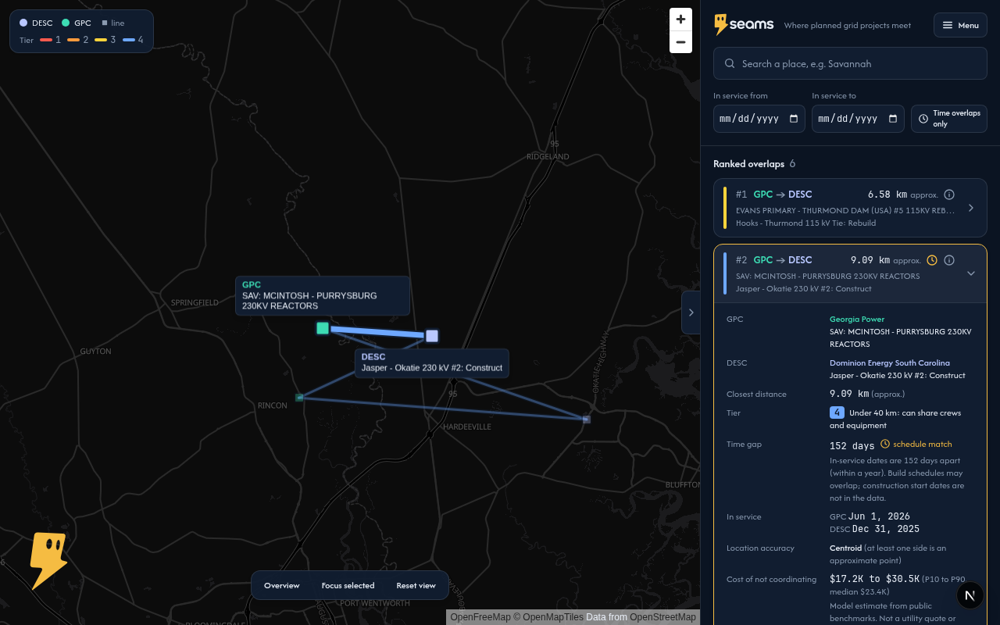
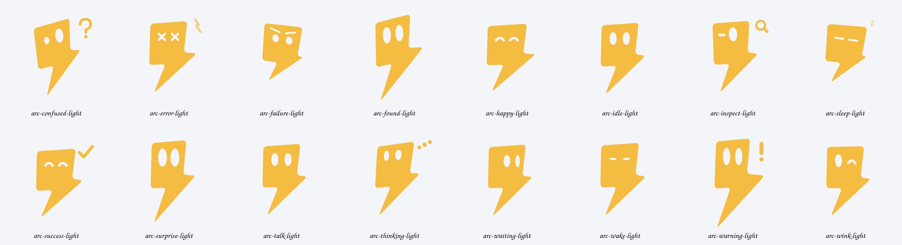

  

<b>Where planned grid projects meet.</b> 
<a href="https://seams.design">seams.design</a>

Seams maps planned electric utility projects and highlights nearby work that could be coordinated.
It helps teams spot shared outage windows, access, logistics, crews, and equipment opportunities.

Built at ShellHacks 2026 for the Sperry Tech GridLock challenge.

## What it does

- Puts planned Georgia Power (GPC) and Dominion Energy South Carolina (DESC) projects on one map.
- Ranks pairs that sit close together by tier (distance), then by schedule.
- Opens a pair to show distance, schedule gap, location accuracy, a cost range and sources.
- Copies or downloads a coordination brief for the people who can check it.

## Meet Arc

Arc is the Seams mascot. He waits on the loading screen, then reacts to what you do: thinking while data loads, pointing when you open a pair, warning on a schedule match, puzzled when filters hide everything, asleep when you step away. Click him for tips, drag him, or press and hold for a squeeze.

## Getting started

Install Node.js, run `npm install`, then `npm run dev` and open the local URL. `npm run build` creates a production build; `npm test` runs the tests.

## Data sources

- Sperry Tech GridLock sample package
- Utility filings
- OpenStreetMap

## Assumptions and limits

The included points and six overlap examples are challenge sample data. Distances are approximate unless both projects have real line geometry from OpenStreetMap. Cost figures are model estimates and are always shown as ranges. The app reads from MongoDB Atlas and falls back to the local JSON files.
