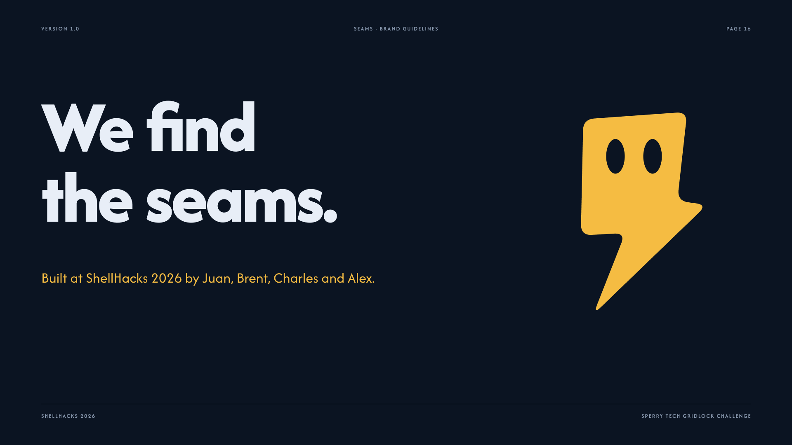

# Seams

**Where planned grid projects meet.** Live at **[seams.design](https://seams.design)** · [Devpost](https://devpost.com/software/seams)

Seams maps planned electric utility projects and highlights nearby work that could be coordinated.
It helps teams spot shared outage windows, access, logistics, crews, and equipment opportunities.
Built at ShellHacks 2026 for the Sperry Tech GridLock challenge.

## Demo video

▶ [Watch on YouTube](https://youtu.be/CgoBQCA358g)

## Overview

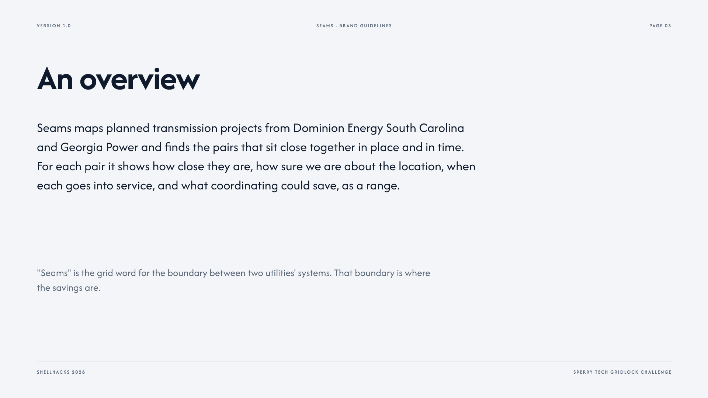

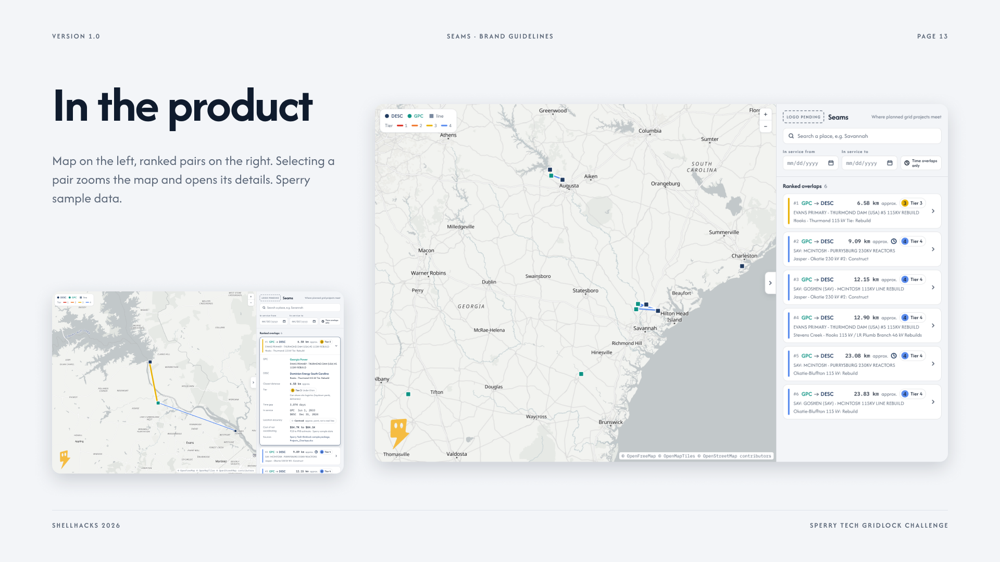

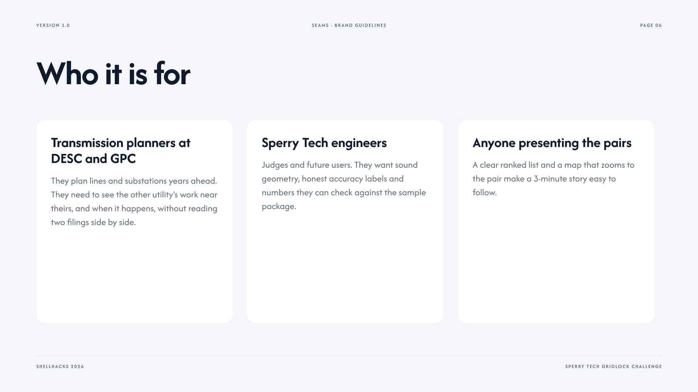

## Arc

Arc waits on the loading screen, then reacts to what you do. Click him for tips, drag him, or press and hold for a squeeze.

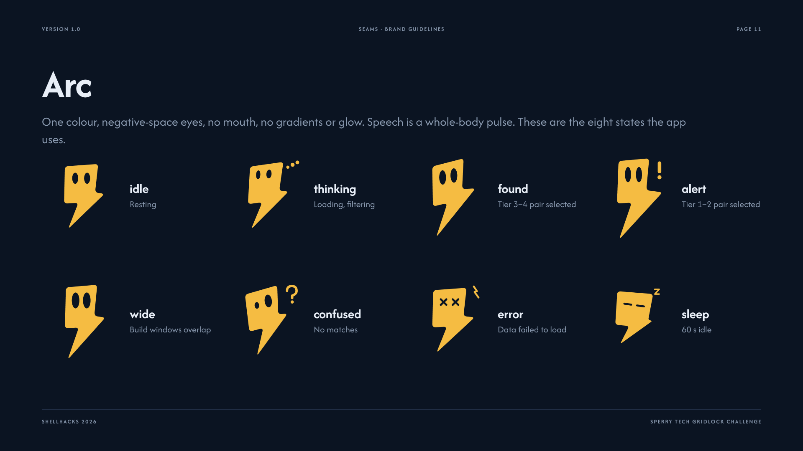

## Data honesty and values

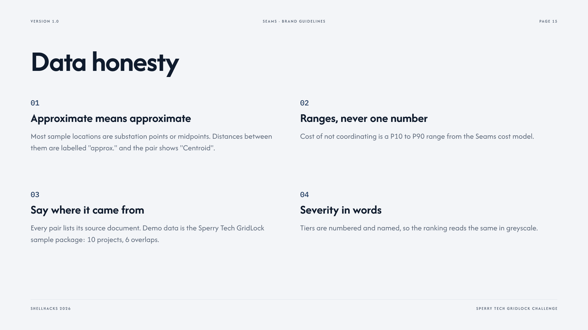

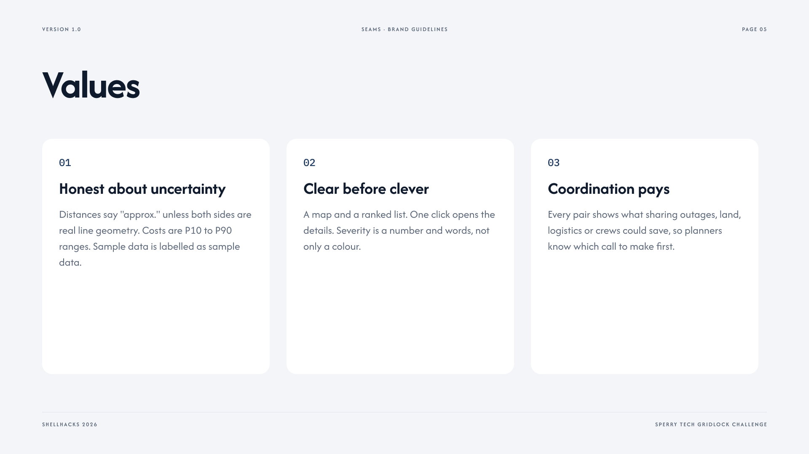

## Brand

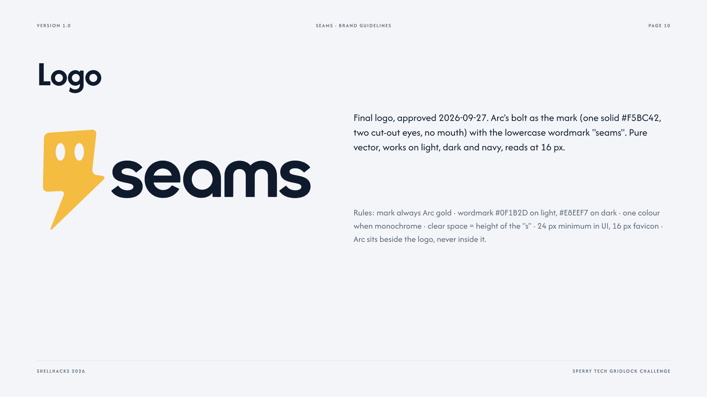

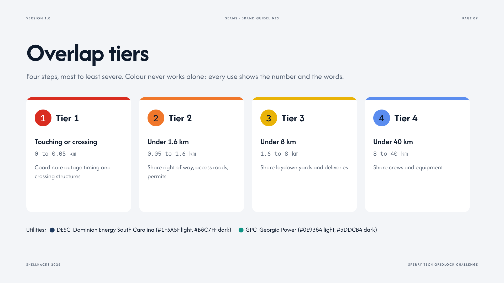

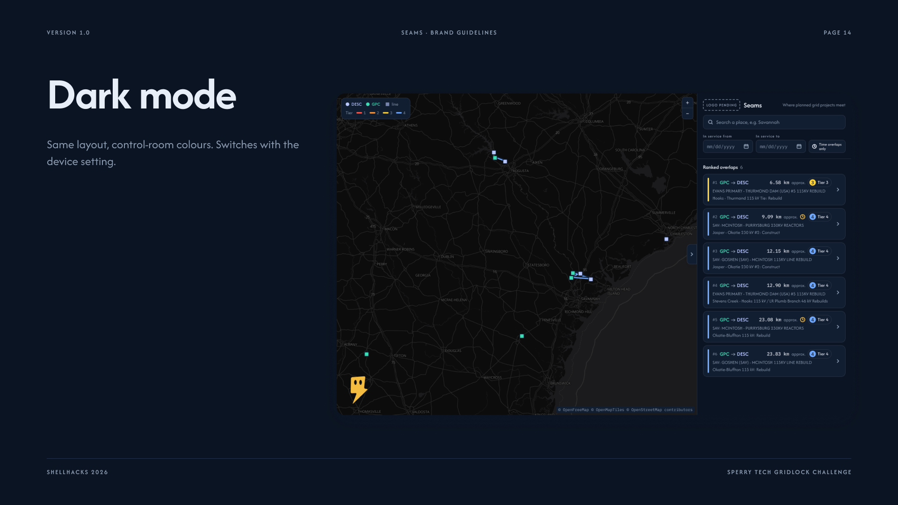

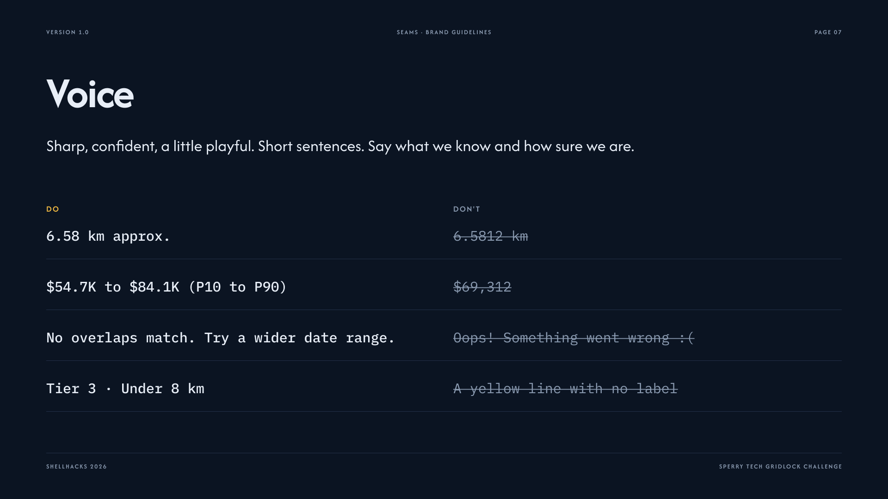

## Getting started

Install Node.js, run `npm install`, then `npm run dev` and open the local URL. `npm run build` creates a production build; `npm test` runs the tests.

## Data sources

- Sperry Tech GridLock sample package
- Utility filings
- OpenStreetMap

## Assumptions and limits

The included points and six overlap examples are challenge sample data. Distances are approximate unless both projects have real line geometry from OpenStreetMap. Cost figures are model estimates and are always shown as ranges. The app reads from MongoDB Atlas and falls back to the local JSON files.
